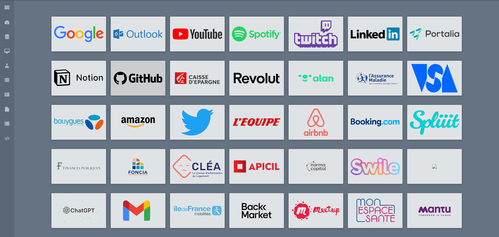

# Page web pour centraliser les principaux sites consultés



Ce projet a été mise en place avec la version 4.2.1 R Studio


Cette page web a été faite facilement gràce au moteur de site web static
[hugo](https://gohugo.io/) et au thème [slate pour
hugo](https://themes.gohugo.io/slate)

La seule librairie nécessaire pour ce projet est blogdown afin
d’exécuter la commande suivante : `blogdown::build_site()`

## :one: Objectif

Ce projet est réalisé pour faciliter le quotidien en centralisant les
principaux sites nécessaires pour répondre à l’ensemble de mes besoins.

- page web en .html qui recense tous les liens importants avec logos
- faciliter d’accéder aux outils nécessaires à mon quotidien

## :two: Documentations

### 2.1 Génération de la page Web

Le site peut ensuite être généré avec
[hugo](https://gohugo.io/overview/introduction/) ou depuis R avec
[blogdown](https://github.com/rstudio/blogdown), une API R pour utiliser
hugo plus facilement.

Avec R :

``` r
blogdown::build_site()
```

Avec Hugo

``` bash
hugo build
```

### 2.2 Thème utilisé

Voir la doc du theme slate sur [le site
themes.gohugo.io](https://themes.gohugo.io/slate) et sur le
[github](https://github.com/gesquive/slate)

## :three: Structure

Ce projet est structuré principalement de la manière suivante:

## 3.1 Ajouter un lien

Il suffit simplement de remplir le fichier `data/link.yml` en ajoutant
une partie de ce type:

``` yaml
-
  name: "Devin Source"
  url: "https://devin-source.rte-france.com/"
  img: "logos/ODESSA/Gitlab.png"
  bg_color: "#E5E5E5"
  txt_color: "#6441a5"
  tags: ["outil", "devin"]
```

Une fois cette ajout effectué, lors d’un nouveau build le lien apparait
sur la page.

### 3.2 Ajouter une catégorie (tag) ?

Les tags servent à gérer les menus de filtre des applis via le fichier
`config.toml`. Si l’on ajoute un nouveau tag, il faut ajouter un nouveau
menu du type

``` toml
[[ params.nav ]]
name = "Perso"
tag = "perso"
icon = "flask" #icone FontAwesome
```

## :four: Contributions

### 4.1 Recherche de logos

Les étapes pour trouver un logo sont les suivantes :

- rechercher un logo assez grand dans lequel le nom du site est indiqué
  explicitement sur *Google*
- supprimer le fond de ce logo pour que la site soit uniforme via le
  site gratuit <https://www.remove.bg/fr/upload>

### 4.2 Développement recherche de logos

Deux possibilités:

- Ouvrir une [ticket]() en indiquant les infos pour compléter le yaml
  - name: pour l’affichage
  - url: url ou ip:port
  - img: lien où en trouver une
  - tags pour le classement
- Faire une Merge Request après avoir modifier le fichier yaml

## :five: Publier une mise à jour de l’appli sur Github (A MODIFIER)

Ci-dessous un lien *IMPORTANT* expliquant comment déployer son
application
<https://docs.github.com/fr/pages/getting-started-with-github-pages/creating-a-github-pages-site>
On y trouve également ce lien important pour le déploiement initial du
projet sur Github
<https://docs.github.com/fr/pages/getting-started-with-github-pages/configuring-a-publishing-source-for-your-github-pages-site>

*Attention*, si l’application ne s’affiche pas lors du déploiement,
n’hésitez pas à supprimer le cache de votre ordinateur qui doit garder
en mémoire l’ancienne version de l’application qui n’est plus
disponible. Pour ce faire, vous devez suivre les étapes suivantes :

- Aller dans les 3 points de suspensions en haut à gauche de votre
  navigateur
- Aller dans Paramètres
- Aller dans Confidentialité et sécurité
- Aller dans Effacer es données de navigation
- Effacer les données des 7 derniers jours par exmeple

Le lien ci-dessous va vous permettre d’e mettre en place d’ouvrir cette
application par défaut au lancement de votre navigateur Chrome
<https://support.google.com/chrome/answer/95314?hl=fr&co=GENIE.Platform%3DDesktop>

L’application est publiée depuis Github:
<https://heikeljazi.github.io/DailyTools/#outil>

Pour faire une mise à jour, une fois le projet Git cloné, il faut faire
les changements, tester l’application localement puis déployer au même
endroit.

Reste à faire :

- être encore plus explicite au niveau du README avec pourquoi pas des
  captures d’écrans
- mettre à jour les tags
- pas obligatoire : trouver comment mettre un background dans
  l’application (pas urgent ni nécessaire) en s’inspirant du commit lié
  à la suppression de la redirection vers outils

## :six: Contacts

Ce projet est développé par Heikel JAZI

Pour toutes remarques ou problèmes, veuillez me contactez à l’adresse
suivante `heikel.j@live.fr` ou sur *LinkedIn* en précisant que vous
parlez de ce projet.
